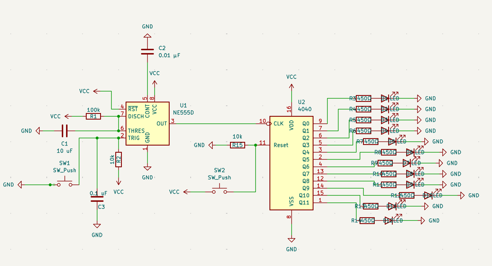
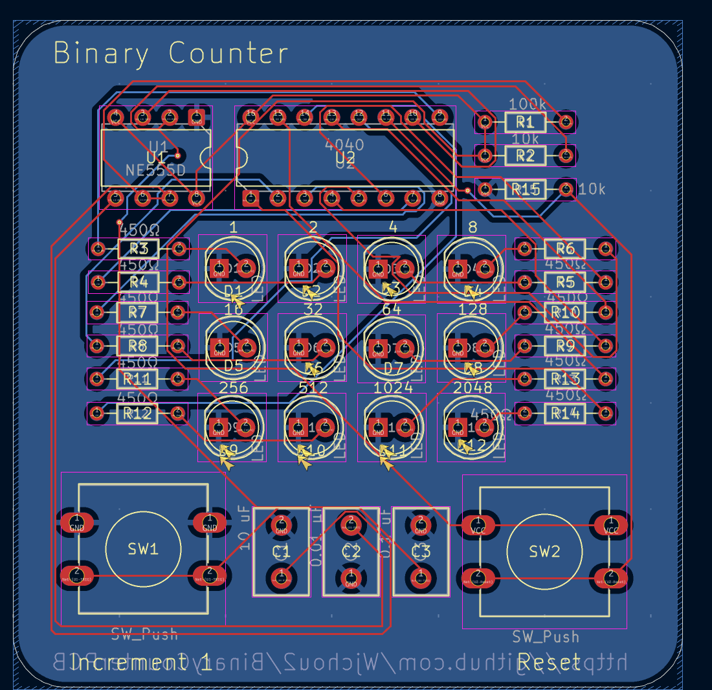
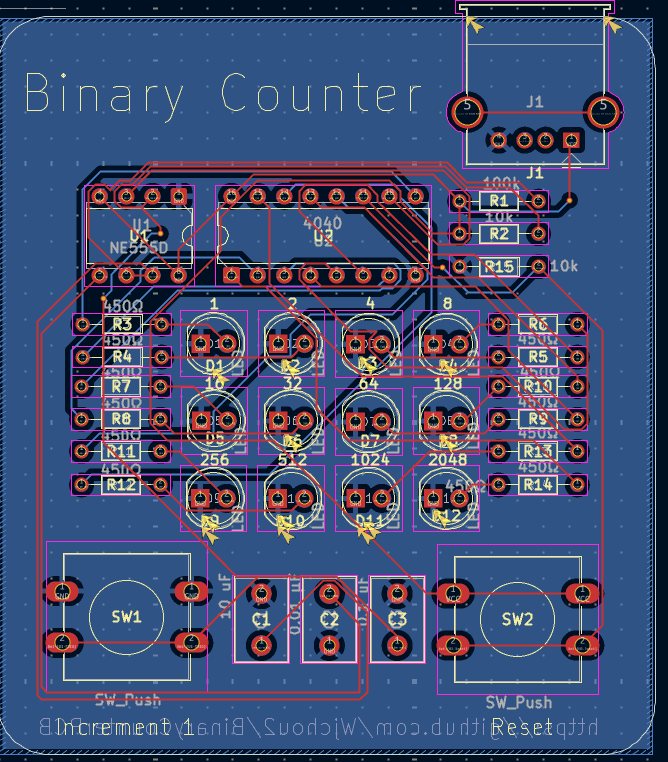

# Tuesday Apr 14 - 85 min
Today I wanted to find an interesting project idea to make. I wanted to make something simple but also somewhat useful and interesting, not just an LED decoration. I looked up IC circuits projects and gained some inspiration. I decided to research the data sheets of the NE555 and CD4040 to make a simple binary counter.
 
I found that the NE555 can generate pulses so I linked that to a SW_Push and wired the output to the input pin of the CD4040 which counts pulses. I then linked an LED to each output Q pin of the CD4040 in order to show the count in binary! I then added another button to the reset pin of the CD4040 to reset count to zero. 

One major challenged I faced was figuring out how to make the NE555 monostable and only generate pulses when the switch was pressed. I did some research and looked up diagrams online to help me figure out the wiring.

# Thursday Apr 16 - 110 min
Today my goal was to sit down and finish up the PCB. I started by finding the correct footprints for each symbol. I had learned from before that THT means through hole technology, which is easier to soldier to the board, so I made sure to select those. 

After, I started working on the actual PCB, and wiring. One thing I learned was how a ground pour worked, when wiring on B.cu, the spots around those wires became clear, and not blue. This is actually intentional and prevents those wires from being connected to GND.

I decided to go for a 4x3 LED layout. Originally I wanted everything to be in one row, to make the counting up very clear, however I decided it would be too long, while this design is more compact. I then labeled each LED with it's value 1,2,4,8 ect. 

After thinking I finished the PCB, I realized i forgot to add a way to supply power, so I added a USB A receptacle and expanded the board a bit to fit it on the top. I then organized and added more silkscreen text, I labeled the 2 buttons to increment and reset the count and added a board name and the github repo.

Also, I figured out how to use Obsidian and push directly to github, making journalling a lot easier!